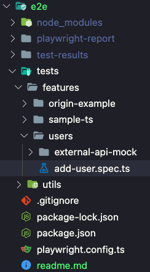

# Separate folders for test cases by feature perspective


# Prepare
**please install node 18 and docker-compose first**  
If you are using macOS and Podman, please add the following settings to your ~/.zshrc file.  
Please adjust the following settings according to your OS and container application.
```
# Testcontainers for NodeJS
export DOCKER_HOST=unix://$(podman machine inspect --format '{{.ConnectionInfo.PodmanSocket.Path}}')
export TESTCONTAINERS_DOCKER_SOCKET_OVERRIDE=/var/run/docker.sock
export TESTCONTAINERS_RYUK_DISABLED=true
```

# Usage
## Start headless e2e test
```
npm ci
npm run test
```

## Start e2e test with UI
```
npm run ui
```
you can choice which test case you want to run.

## Confirm Test Report
```
npm run report
```

## Generate TypeORM Entities from database
**[typeorm-model-generator](https://www.npmjs.com/package/typeorm-model-generator)**
```
npm run generate:entities # Create Entity class from Database schema
npm run convert:entities # Compile Entity from ts to js
```
**Be careful to use the JS version of Entity when using Entity in your test code.Because Playwright doesn't support experimental Typescript notation like annotations.**

# One-stop e2e test cases
add-user.spec.ts

# Use testcontainers to startup containers
containers.ts

I set gloabl-setup.ts and global-teardown.ts into 
playwright.config.ts to start and stop the container environment before and after playwright starts.

# Use TypeORM to interact with Database
DbDataSource.ts

# Use WiremockRestClient to interact with ExternalApi
ExternalApiMock.ts

# Use Node-Redis to interact with Redis
RedisClient.ts